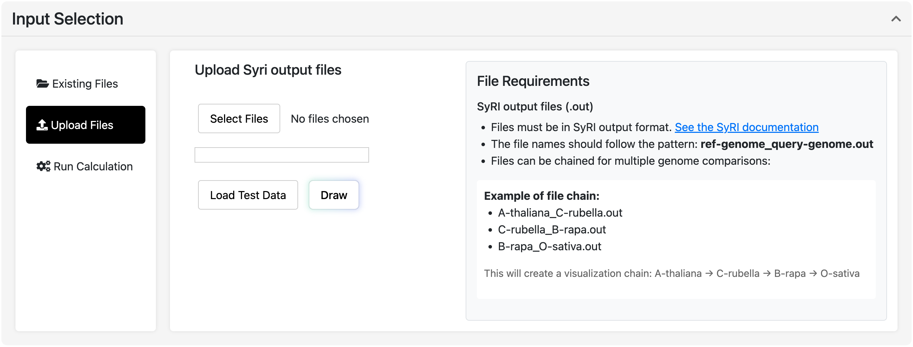

### 🚨 **Main Server Temporarily Unavailable**

The main SynFlow server is currently **down due to technical issues**.

##### ✅ **Working Demo Available** 👇
[**https://southgreenplatform.github.io/SynFlow/**](https://southgreenplatform.github.io/SynFlow/)

***Available features***:
- ✅ Genome visualization 
- ✅ Full user interface
- ✅ Banana / Grapevine datasets

***⚠️ Temporary limitations***:
- ❌ **Run analysis** require backend server → **unavailable**

### ⏳ Status & Updates

| Service | Status | Details |
|---------|--------|---------|
| Web Interface | 🟢 **OK** | [GitHub Pages Demo](https://southgreenplatform.github.io/SynFlow/) |
| Backend | 🔴 **Down** | Waiting for server recovery|
| Workflows | ❌ **Blocked** | Backend dependent |

**We'll update you as soon as the main server is back online.**

*For questions/paper reviewers: contact [marilyne.summo@cirad.fr]*

## Description

Synflow is a powerful web application for visualizing genome alignments and structural variations using SyRI (Structural Rearrangement Identifier) data. It provides an interactive platform for exploring genomic synteny, inversions, translocations, duplications, and other structural rearrangements between genomes.

Synflow is available for free to use at [synflow.southgreen.fr](synflow.southgreen.fr)

A more descriptive documention of SynFlow is available [https://synflow.readthedocs.io/en/latest/](https://synflow.readthedocs.io/en/latest/)

A Snakemake workflow to detect synteny blocks and identify chromosomal rearrangements [https://gitlab.cirad.fr/agap/cluster/snakemake/synflow](https://gitlab.cirad.fr/agap/cluster/snakemake/synflow)

## Features
- Use precomputed datasets or run your own analysis  
- Chain multiple genome comparisons for comprehensive analysis  
- Drag and drop chromosomes to reorder them  
- Detailed control panel for customizing visualizations  
- Download the visualization as an SVG file 

## Usage

#### SyRI output files (.out)
- Files must be in SyRI output format. [See the SyRI documentation](https://schneebergerlab.github.io/syri/fileformat.html)
- The file names should follow the pattern: **ref-genome_query-genome.out**
- Files can be chained for multiple genome comparisons:

Example of file chain:
- A-thaliana_C-rubella.out
- C-rubella_B-rapa.out
- B-rapa_O-sativa.out
  
This will create a visualization chain: **A-thaliana → C-rubella → B-rapa → O-sativa**

#### Four ways to input data:

  - **Existing files**: select from precomputed datasets. The available files come from analyses performed on several organisms using the workflow [See the documentation](https://gitlab.cirad.fr/agap/cluster/snakemake/synflow)
  - **Run analysis**: run workflow using **fasta + gff3 files (optional)**  
  - **Browse FTP**: import files directly from an FTP server by providing the URL
  - **Upload file**: use the "Browse" button to upload your own files

#### Click the "Draw" button to generate the visualization.
Use the zoom and pan features to explore the visualization. 
Chromosome order can be changed by drag and drop.

#### Filter the bands using the legend and the slider.

## License

This project is licensed under the terms of the GNU General Public License v3.0. See the [LICENSE](./LICENSE) file for details.

## Authors

- Marilyne Summo
- Gaëtan Droc
- Mathieu Rouard
- Gautier Sarah

See also the list of [contributors](https://github.com/SouthGreenPlatform/SynFlow/contributors) who participated in this project.

## Acknowledgements

- Special thanks to the contributors of the [SyRI tool](https://github.com/schneebergerlab/syri).
- Inspiration from [plotsr](https://github.com/schneebergerlab/plotsr).
