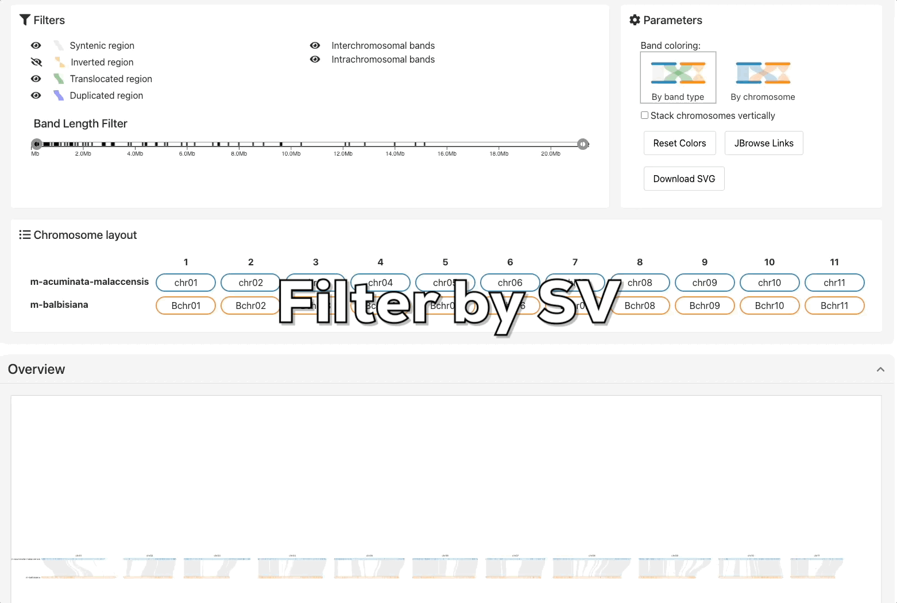
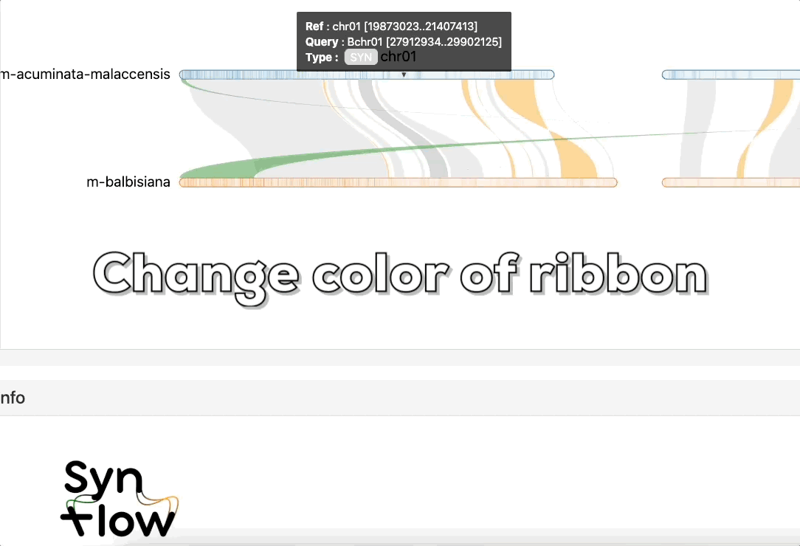

## Control panel

The control panel allows you to:

- Filter structural variation bands based on their type and size
- Change color band
- Reordering chromosomes 
- Download the current visualization in SVG format for high-quality export

---

## Customized panel

Chromosome and ribbon colors can be customized, and ribbons can be selected and merged based on their distance from one another. 

