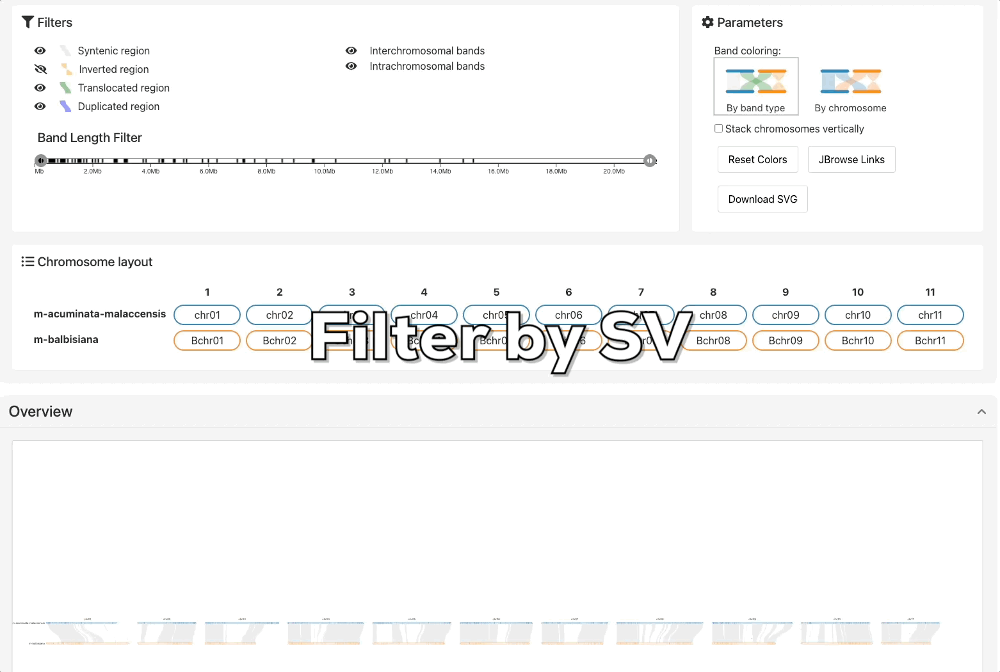
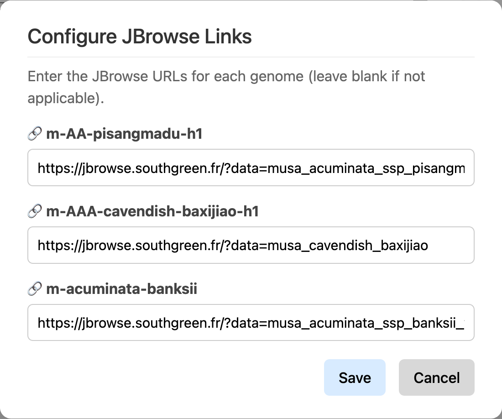
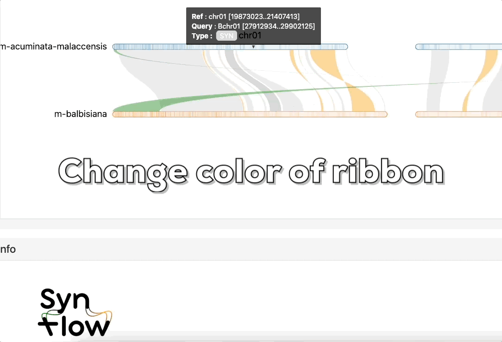

## Control panel

The control panel provides interactive controls that let you refine your analysis and customize the display to suit your needs:

- **Filter structural variation bands**: Dynamically filter the displayed bands by their type (insertions, deletions, inversions, etc.) and size thresholds. This allows you to focus on variations of specific interest and reduce visual clutter in complex datasets.
- **Change color scheme**: Color code your structural variation bands by type (to easily distinguish between insertions, deletions, inversions, etc.) or by chromosome (to visually emphasize evolutionary patterns across different genomic regions). 
- **Reorder chromosomes**: Rearrange the chromosomal display by shifting individual chromosomes one at a time or entire columns of chromosomes together for larger reorganizations.
- **Export visualization**: Download your current visualization as a high-quality SVG file.

## JBrowse links

Generate direct links to JBrowse genome browser for selected genomes.

## Customized panel

Chromosome and ribbon colors can be customized, and ribbons can be selected and merged based on their distance from one another. 

