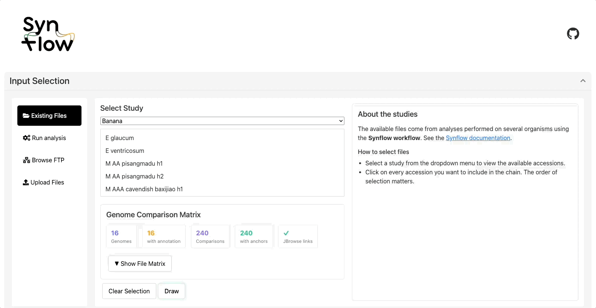
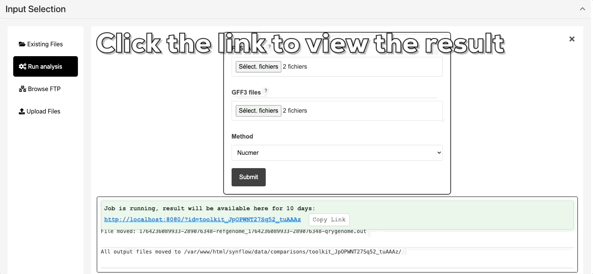
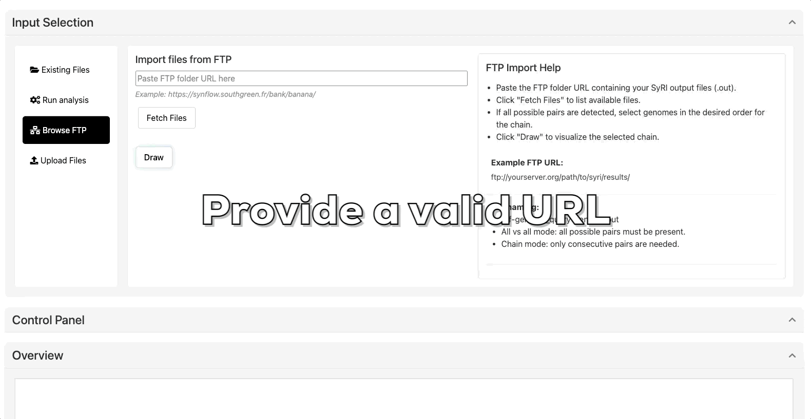
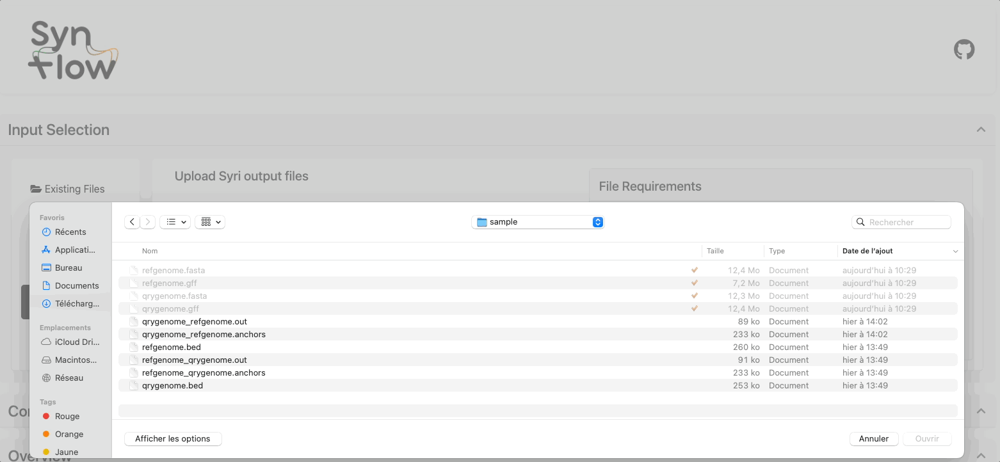

# Input
You can explore genomic comparisons in four ways:

- [Use an existing dataset](#use-an-existing-dataset)
- [Run analysis](#run-analysis)
- [Browse FTP](#browse-ftp)
- [Upload your own SyRI results](#upload-your-own-syri-output)

## Use an existing dataset

To explore without uploading anything, you can choose from a list of curated genome comparisons available for:

- **Banana** (*Musa* species)
- **Grapevine** (*Vitis* species)

Go to the **“Existing files”** tab.

Click **Draw** to visualize the structural variants.

---

## Run analysis

Don’t have SyRI results yet? Upload at least two FASTA files along with matching GFF3 files sharing the same prefix 

**Synmake** pipeline will compute alignments and run SyRI for you.

[Synmake](https://gitlab.cirad.fr/agap/cluster/snakemake/synflow) is a Snakemake-based workflow developed to generate SyRI-compatible results for use in Synflow.

The workflow can either be executed directly from the web application or installed and run locally.
If run locally, the results can be shared with Synflow by providing a public URL in the "Browse FTP" section of the web application.

**Required files:**

- FASTA files: Genome assemblies in FASTA format
- Minimum 2 genomes required

**Optional but recommanded inputs:**

- GFF3 files: Gene annotations (required only for MCScanX analysis)
  
Must be provided for all genomes. The same prefix must be used if synteny involves genomes with different chromosome counts.
These files are also required for protein extraction and gene-based synteny detection.

Go to the **“Run analysis”** tab.

---

Once the workflow has finished, a link will appear allowing you to directly load the generated results into the same section as “Browse FTP” within the web application.
This link provides quick access to all output files produced by the workflow, enabling you to visualize or reuse them in Synflow without having to manually transfer or upload data.

---

## Browse FTP

If you have already generated SyRI results locally using the Synmake workflow or another compatible pipeline, you can directly provide them to Synflow without uploading files manually.
To do so, go to the “Browse FTP” section of the web application and submit the public URL pointing to your results directory.

The application will automatically fetch the required files (such as alignment, annotation, and SyRI output files) from the provided location.
Once validated, the data will be accessible in the same interface as results generated directly through the web-based workflow, allowing seamless visualization and comparison across datasets.

---
## Upload your own SyRI output

Files must be in SyRI output results in TSV formats. [See the SyRI documentation](https://schneebergerlab.github.io/syri/fileformat.html)

Go to the **“Upload files”** tab.

---

 
