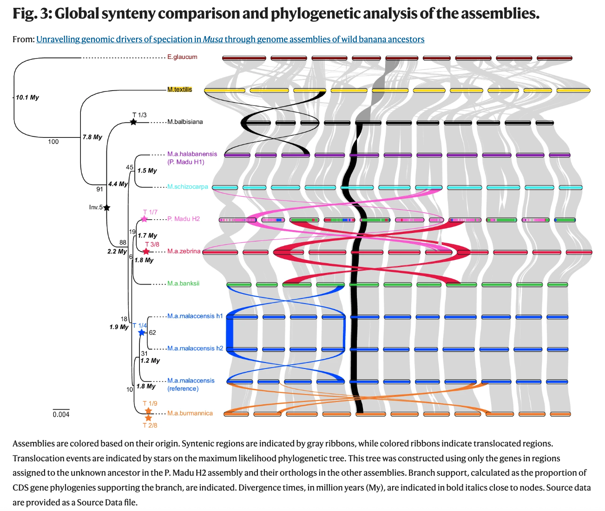

## Vizualisation

The visualization interface provides an interactive and intuitive exploration of genomic structural variations. Key features include:

- **Interactive zoom and pan functionality**: Use your mouse to zoom in and out, and pan across the visualization to explore regions of interest at different scales.
- **Chromosome control**: Reorder chromosomes, toggle visibility of individual chromosomes (Show/Hide), and customize the display layout to focus on specific genomic regions (see [Control panel](control.md#control-panel) for more information).
- **Dynamic filtering**: Apply filters to structural variation bands based on type and size (see [Control panel](control.md#control-panel) for more information).
- **Click for details**: Click directly on a band to view comprehensive information about that structural variation, including genomic coordinates, type, size, and other relevant details (see [Block Details](block_details.md) for more information).

-------
The structural variations described in the Martin et al. (2025) study can be visualized and explored using synflow, as seen in the gif above.

> Martin, G., Istace, B., Baurens, F.C. *et al.* (2025). *Unravelling genomic drivers of speciation in Musa through genome assemblies of wild banana ancestors.* **Nature Communications**, 16, 961. [https://doi.org/10.1038/s41467-025-56329-4](https://doi.org/10.1038/s41467-025-56329-4)
